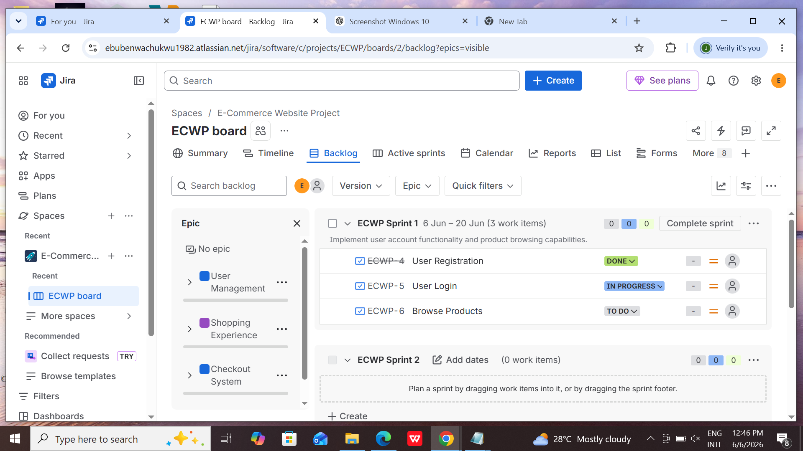
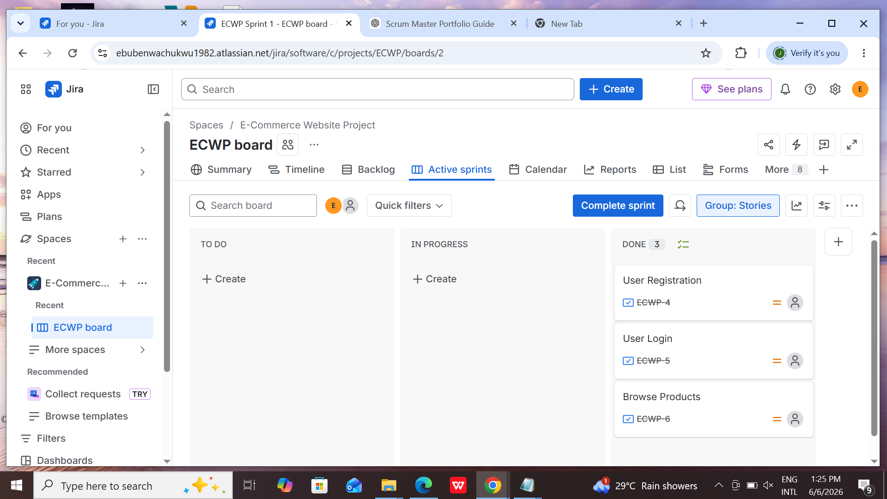
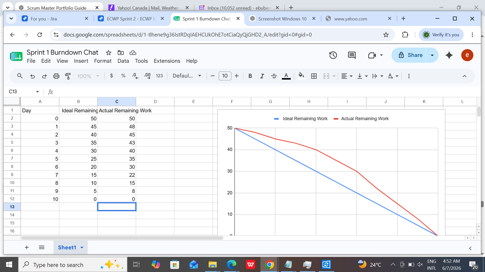

# E-Commerce Website Scrum Project

## Overview

This repository showcases the application of Scrum principles and Agile project management practices in the development of an E-Commerce Website.

The project was managed using Scrum and demonstrates backlog management, sprint planning, sprint execution, sprint reviews, sprint retrospectives, and Agile reporting using Jira.

---

## My Role

**Scrum Master**

### Responsibilities

* Facilitated Sprint Planning sessions
* Managed and refined the Product Backlog
* Tracked sprint progress using Jira
* Facilitated Sprint Reviews and Retrospectives
* Supported Agile best practices
* Monitored team delivery and sprint outcomes

---

## Project Goal

Develop an E-Commerce platform that enables customers to:

* Create an account
* Log in securely
* Browse products
* Search for products
* Add products to a shopping cart
* Complete purchases through checkout

---

## Scrum Framework Used

* Sprint Planning
* Daily Stand-Ups
* Product Backlog Refinement
* Sprint Reviews
* Sprint Retrospectives
* Continuous Improvement

---

## Product Backlog Structure

### Epic 1: User Management

* User Registration
* User Login

### Epic 2: Shopping Experience

* Browse Products
* Search Products
* Add To Cart

### Epic 3: Checkout System

* Checkout

---

# Sprint 1

## Sprint Goal

Implement user account functionality and product browsing capabilities.

### User Stories Delivered

* ECWP-4 User Registration
* ECWP-5 User Login
* ECWP-6 Browse Products

### Sprint Outcome

The team successfully delivered foundational customer account functionality and product browsing features required for future shopping capabilities.

### Sprint Artifacts

* Sprint-1-Goal.md
* Sprint-1-Backlog.md
* Sprint-1-Review.md
* Sprint-1-Retrospective.md

---

# Sprint 2

## Sprint Goal

Enhance the shopping experience by implementing search, cart, and checkout functionality.

### User Stories Delivered

* ECWP-7 Search Products
* ECWP-8 Add To Cart
* ECWP-9 Checkout

### Sprint Outcome

The team successfully delivered the complete customer purchasing workflow from product discovery through checkout.

### Sprint Artifacts

* Sprint-2-Goal.md
* Sprint-2-Backlog.md
* Sprint-2-Review.md
* Sprint-2-Retrospective.md

---

# Jira Evidence

## Product Backlog ( sprint 1)

## Completed User Stories (sprint 1)

## Burndown Chart( sprint 1)

---

# Repository Contents

## Project Documentation

* Case-Study.md
* Product-Backlog.md

## Sprint 1 Documentation

* Sprint-1-Goal.md
* Sprint-1-Backlog.md
* Sprint-1-Review.md
* Sprint-1-Retrospective.md

## Sprint 2 Documentation

* Sprint-2-Goal.md
* Sprint-2-Backlog.md
* Sprint-2-Review.md
* Sprint-2-Retrospective.md

---

# Tools Used

* Jira
* GitHub
* Scrum Framework

---

# Key Scrum Deliverables

* Product Backlog
* Sprint Backlogs
* Sprint Goals
* Sprint Reviews
* Sprint Retrospectives
* Burndown Tracking
* Agile Reporting
* Stakeholder Feedback Documentation

---

# Project Status

✅ Sprint 1 Completed

✅ Sprint 2 Completed

✅ Scrum Documentation Completed

✅ Portfolio Ready
